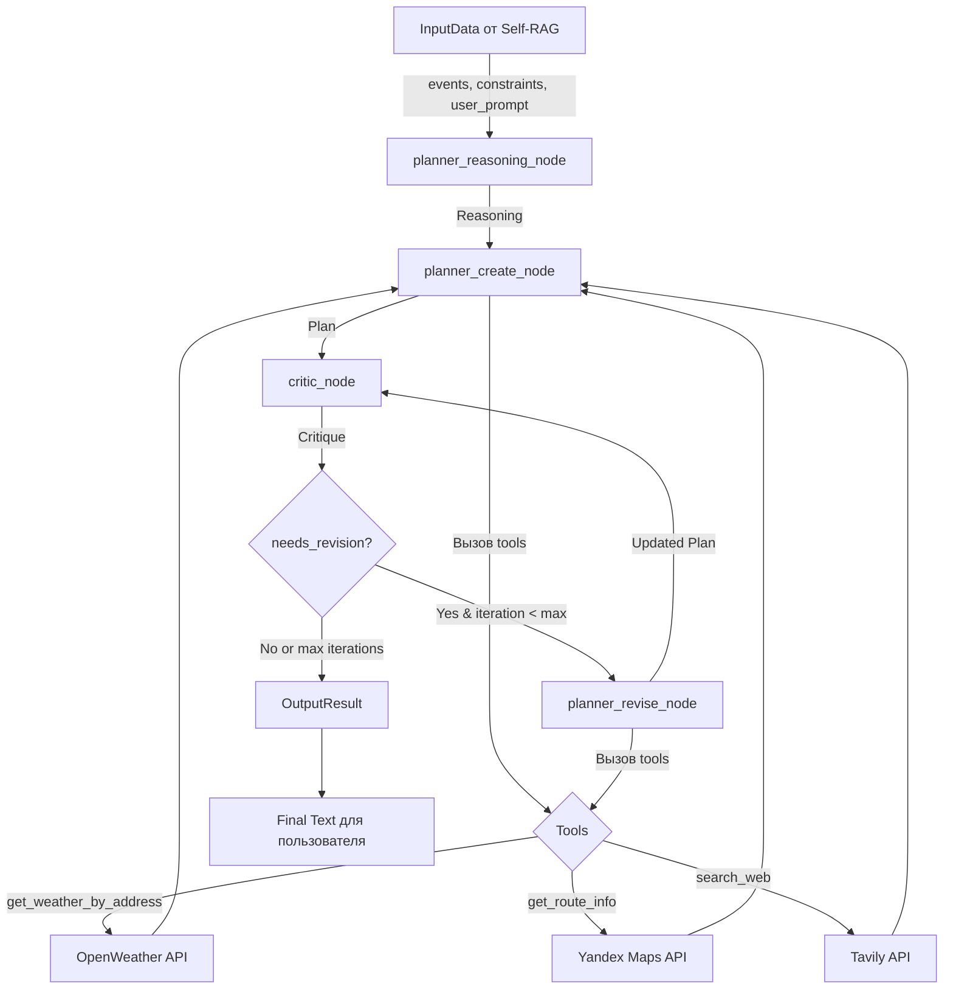

# Архитектура компонента Planner Agent

## Общая схема

```
┌─────────────────────────────────────────────────────────────────┐
│                        INPUT FROM SELF-RAG                      │
│                                                                 │
│  InputData:                                                     │
│  ├─ events: List[Event]         (релевантные события)          │
│  ├─ user_prompt: str            (запрос пользователя)          │
│  └─ constraints: Constraints    (время, бюджет, транспорт)     │
└─────────────────────────────────────────────────────────────────┘
                                ↓
┌─────────────────────────────────────────────────────────────────┐
│                       PLANNING GRAPH                            │
│                      (LangGraph Workflow)                       │
│                                                                 │
│  ┌───────────────────────────────────────────────────────────┐ │
│  │  NODE 1: planner_reasoning                                │ │
│  │  ────────────────────────────                             │ │
│  │  Агент: PlannerAgent                                      │ │
│  │  Задача:                                                  │ │
│  │  • Анализирует события и ограничения                      │ │
│  │  • Выявляет проблемы и вызовы                             │ │
│  │  • Формирует стратегию планирования                       │ │
│  │                                                            │ │
│  │  Output: Reasoning                                         │ │
│  │    ├─ analysis: str                                        │ │
│  │    ├─ considerations: List[str]                            │ │
│  │    ├─ challenges: List[str]                                │ │
│  │    └─ strategy: str                                        │ │
│  └───────────────────────────────────────────────────────────┘ │
│                                ↓                                │
│  ┌───────────────────────────────────────────────────────────┐ │
│  │  NODE 2: planner_create                                   │ │
│  │  ───────────────────────                                  │ │
│  │  Агент: PlannerAgent + Tools                              │ │
│  │  Задача:                                                  │ │
│  │  • Создаёт оптимальный план на основе reasoning           │ │
│  │  • Использует инструменты для получения данных            │ │
│  │  • Формирует хронологическую последовательность           │ │
│  │                                                            │ │
│  │  Tools используемые:                                       │ │
│  │  ┌──────────────────────────────────────────────────────┐ │ │
│  │  │  🌤️  get_weather / get_weather_by_address           │ │ │
│  │  │  📍  get_route_info (walking/car/bus)                │ │ │
│  │  │  🔍  search_web (актуальная информация)              │ │ │
│  │  └──────────────────────────────────────────────────────┘ │ │
│  │                                                            │ │
│  │  Output: Plan                                              │ │
│  │    ├─ items: List[PlanItem]                                │ │
│  │    ├─ total_duration_minutes: int                          │ │
│  │    ├─ total_travel_time_minutes: int                       │ │
│  │    ├─ summary: str                                         │ │
│  │    ├─ included_events: List[str]                           │ │
│  │    └─ excluded_events: List[str]                           │ │
│  └───────────────────────────────────────────────────────────┘ │
│                                ↓                                │
│  ┌───────────────────────────────────────────────────────────┐ │
│  │  NODE 3: critic                                           │ │
│  │  ───────────────                                          │ │
│  │  Агент: CriticAgent                                       │ │
│  │  Задача:                                                  │ │
│  │  • Оценивает план по критериям:                           │ │
│  │    - Логистика (время в пути, расстояния)                 │ │
│  │    - Соответствие ограничениям (бюджет, время)            │ │
│  │    - Реалистичность (время на очереди, паузы)             │ │
│  │  • Выявляет критические проблемы                          │ │
│  │  • Даёт конкретные рекомендации                           │ │
│  │                                                            │ │
│  │  Output: Critique                                          │ │
│  │    ├─ overall_assessment: str                              │ │
│  │    ├─ strengths: List[str]                                 │ │
│  │    ├─ weaknesses: List[str]                                │ │
│  │    ├─ suggestions: List[str]                               │ │
│  │    ├─ critical_issues: List[str]                           │ │
│  │    └─ needs_revision: bool  ◄─── УСЛОВИЕ                  │ │
│  └───────────────────────────────────────────────────────────┘ │
│                                ↓                                │
│                    ┌─────────────────────┐                      │
│                    │  DECISION POINT     │                      │
│                    │  needs_revision?    │                      │
│                    └─────────────────────┘                      │
│                      ↓               ↓                          │
│               YES (revise)      NO (finish)                     │
│                      ↓               ↓                          │
│  ┌───────────────────────────────┐  │                          │
│  │  NODE 4: planner_revise       │  │                          │
│  │  ───────────────────────       │  │                          │
│  │  Агент: PlannerAgent + Tools  │  │                          │
│  │  Задача:                      │  │                          │
│  │  • Дорабатывает план          │  │                          │
│  │  • Учитывает критику          │  │                          │
│  │  • Исправляет проблемы        │  │                          │
│  │                               │  │                          │
│  │  Output: Updated Plan         │  │                          │
│  └───────────────────────────────┘  │                          │
│                      │               │                          │
│                      └───► critic ───┘                          │
│                      (до max_iterations)                        │
│                                                                 │
└─────────────────────────────────────────────────────────────────┘
                                ↓
┌─────────────────────────────────────────────────────────────────┐
│                           OUTPUT                                │
│                                                                 │
│  OutputResult:                                                  │
│  ├─ final_plan: Plan              (финальный план)             │
│  ├─ reasoning: Reasoning           (рассуждения)               │
│  ├─ critique: Critique             (последняя критика)         │
│  ├─ iterations: int                (количество итераций)       │
│  ├─ weather_info: Dict             (использованная погода)     │
│  ├─ maps_info: Dict                (использованные маршруты)   │
│  ├─ web_info: Dict                 (использованная веб-инфо)   │
│  └─ final_text: str                (форматированный текст)     │
└─────────────────────────────────────────────────────────────────┘
```

---

## Детальное описание компонентов

### 1. Входные данные (InputData)

**Источник**: Self-RAG Agent

**Структура**:
```python
class InputData:
    events: List[Event]          # Релевантные события из векторной БД
    user_prompt: str             # Оригинальный запрос пользователя
    constraints: Constraints     # Извлечённые ограничения
```

**Constraints**:
- `start_time` / `end_time` — временные рамки
- `max_total_time_minutes` — максимальная длительность
- `preferred_transport` — предпочитаемый транспорт
- `budget` — бюджет
- `other_constraints` — другие требования (текст)

---

### 2. Planning Graph (LangGraph)

#### Состояние графа (GraphState)

```python
class GraphState:
    input_data: InputData            # Входные данные
    reasoning: Optional[Reasoning]   # Рассуждения планировщика
    plan: Optional[Plan]             # Текущий план
    critique: Optional[Critique]     # Критика плана
    iteration: int                   # Текущая итерация
    max_iterations: int              # Лимит итераций (default: 1)
    weather_info: Dict               # Кэш погоды
    maps_info: Dict                  # Кэш маршрутов
    web_info: Dict                   # Кэш веб-поиска
```

---

### 3. Узлы графа (Nodes)

#### NODE 1: `planner_reasoning_node`

**Агент**: `PlannerAgent`

**Вход**: 
- `input_data.events` — список событий
- `input_data.constraints` — ограничения

**Процесс**:
1. Анализирует доступные события
2. Оценивает выполнимость с учётом ограничений
3. Выявляет потенциальные проблемы (например, мало времени, далеко друг от друга)
4. Формирует стратегию планирования

**Выход**: `Reasoning` объект

**Пример reasoning**:
```
analysis: "Пользователь хочет посетить 3 музея в центре Москвы за 5 часов"
considerations: ["Нужно учесть время на очереди", "Музеи рядом — можно дойти пешком"]
challenges: ["Ограниченное время", "Один музей закрывается раньше"]
strategy: "Начать с музея, который закрывается раньше, двигаться по кругу"
```

---

#### NODE 2: `planner_create_node`

**Агент**: `PlannerAgent` с инструментами

**Вход**: 
- `reasoning` — стратегия планирования
- `input_data` — события и ограничения

**Процесс**:
1. Создаёт хронологический план
2. **Вызывает инструменты** (tool calling):
   - `get_weather_by_address(address)` — проверяет погоду
   - `get_route_info(from, to)` — рассчитывает время в пути
   - `search_web(query)` — ищет дополнительную информацию (часы работы, цены)
3. Формирует структурированный `Plan`

**Инструменты (Tools)**:

| Tool | Описание | API |
|------|----------|-----|
| `get_weather` | Погода по координатам | OpenWeather API |
| `get_weather_by_address` | Погода по адресу (геокодинг + погода) | Yandex Geocoder + OpenWeather |
| `get_route_info` | Маршрут между адресами (walking/car/bus) | Yandex Maps |
| `search_web` | Веб-поиск актуальной информации | Tavily API |

**Выход**: `Plan` объект

**Структура Plan**:
```python
class Plan:
    items: List[PlanItem]           # Последовательность событий
    total_duration_minutes: int     # Общее время
    total_travel_time_minutes: int  # Время в пути
    summary: str                    # Краткое описание
    included_events: List[str]      # Какие события включены
    excluded_events: List[str]      # Какие события не вошли
```

**Структура PlanItem**:
```python
class PlanItem:
    event_name: str                # Название события
    event_address: str             # Адрес
    start_time: time               # Время начала
    end_time: time                 # Время окончания
    duration_minutes: int          # Длительность
    transport_mode: str            # Транспорт до события
    travel_time_minutes: int       # Время в пути
    notes: str                     # Дополнительные заметки
```

---

#### NODE 3: `critic_node`

**Агент**: `CriticAgent`

**Вход**: 
- `plan` — созданный план
- `input_data` — оригинальные данные

**Процесс**:
1. **Оценивает план по критериям**:
   - ✅ **Логистика**: реалистично ли время в пути
   - ✅ **Соответствие ограничениям**: время, бюджет, транспорт
   - ✅ **Полнота**: учтены ли все пожелания пользователя
   - ✅ **Практичность**: есть ли время на очереди, паузы
2. **Выявляет проблемы**:
   - Критические (требуют обязательного исправления)
   - Рекомендации (желательно улучшить)
3. **Принимает решение**: `needs_revision = True/False`

**Выход**: `Critique` объект

**Структура Critique**:
```python
class Critique:
    overall_assessment: str       # Общая оценка
    strengths: List[str]          # Сильные стороны
    weaknesses: List[str]         # Слабые стороны
    suggestions: List[str]        # Предложения
    critical_issues: List[str]    # Критические проблемы
    needs_revision: bool          # Требуется ли пересмотр
```

**Пример critique**:
```
overall_assessment: "План логичен, но слишком плотный"
strengths: ["Все события в центре", "Оптимальная последовательность"]
weaknesses: ["Нет времени на обед", "Переезд между 2 и 3 событием долгий"]
suggestions: ["Добавить паузу 30 мин на обед", "Изменить порядок событий"]
critical_issues: ["Музей №3 будет закрыт к моменту прибытия"]
needs_revision: True
```

---

#### NODE 4: `planner_revise_node` (условный)

**Условие активации**: `critique.needs_revision == True` И `iteration < max_iterations`

**Агент**: `PlannerAgent` с инструментами

**Вход**: 
- `plan` — текущий план
- `critique` — критика с конкретными рекомендациями

**Процесс**:
1. Анализирует критику
2. Исправляет критические проблемы
3. Учитывает рекомендации
4. Использует инструменты для уточнения данных
5. Создаёт обновлённый план

**Выход**: `Plan` (обновлённый)

**Цикл**: План снова отправляется в `critic_node` для проверки

**Лимит итераций**: `max_iterations` (по умолчанию 1, макс 3)

---

### 4. Агенты (Agents)

#### PlannerAgent

**Роль**: Планировщик выходных

**Ключевые методы**:
- `create_reasoning(state)` → `Reasoning`
- `create_plan(state)` → `Plan`
- `revise_plan(state)` → `Plan` (updated)
- `render_telegram_message(state)` → `str` (форматированный текст)

**LLM**: GPT-4o или GPT-4o-mini (через `JourneyLLM`)

**Особенности**:
- Использует `llm.bind_tools()` для интеграции инструментов
- Structured outputs через Pydantic модели
- Промпты оптимизированы для русского языка

---

#### CriticAgent

**Роль**: Критик и валидатор планов

**Ключевые методы**:
- `critique_plan(state)` → `Critique`

**LLM**: GPT-4o или GPT-4o-mini

**Особенности**:
- Объективная оценка без предвзятости
- Фокус на практичность и реалистичность
- Structured output для конкретных рекомендаций

---

### 5. Выходные данные (OutputResult)

**Структура**:
```python
class OutputResult:
    final_plan: Plan                # Финальный план
    reasoning: Reasoning            # Исходные рассуждения
    critique: Critique              # Последняя критика
    iterations: int                 # Количество итераций
    weather_info: Dict              # Использованная погода
    maps_info: Dict                 # Использованные маршруты
    web_info: Dict                  # Использованная веб-инфо
    final_text: str                 # Форматированный текст для пользователя
```

**final_text** — готовый Markdown-текст для отправки в Telegram:
- 📅 Хронологический план с временными слотами
- 📍 Адреса и способы добраться
- 🌤️ Погода на момент событий
- 💡 Полезные советы
- 🚶 Время в пути между точками

---

## Flow диаграмма (Mermaid)



---

## Ключевые особенности архитектуры

### ✅ Преимущества

1. **Многоэтапное планирование**
   - Разделение на reasoning → planning → critique → revision
   - Явные промежуточные результаты

2. **Tool calling**
   - Реальные данные о погоде, маршрутах, веб-информации
   - LangChain интеграция через `bind_tools()`

3. **Итеративное улучшение**
   - Planner ⇄ Critic loop
   - Автоматическое исправление критических проблем

4. **Structured outputs**
   - Pydantic модели для валидации
   - Предсказуемая структура данных

5. **Расширяемость**
   - Легко добавить новые инструменты
   - Можно менять количество итераций
   - Модульная архитектура агентов

### ⚠️ Текущие ограничения

1. **Много вызовов LLM**
   - Каждый tool call = отдельный вызов
   - Потенциал для оптимизации через параллелизацию

2. **Фиксированный лимит итераций**
   - max_iterations=1 по умолчанию
   - Не всегда достаточно для сложных планов

3. **Отсутствие кэширования**
   - Повторные запросы погоды/маршрутов
   - Можно добавить Redis для кэша

---

## Примеры использования

### Пример 1: Простой запрос

**Input**:
```python
InputData(
    events=[Event1, Event2, Event3],
    user_prompt="Хочу посетить музеи в центре Москвы в субботу с 10:00 до 18:00",
    constraints=Constraints(start_time="10:00", end_time="18:00")
)
```

**Процесс**:
1. `reasoning`: "3 музея, 8 часов, все в центре — выполнимо"
2. `create_plan`: создаёт план с временными слотами, вызывает `get_route_info`
3. `critic`: "План хороший, но нет обеда" → needs_revision=False (т.к. не критично)
4. `output`: финальный план с 3 музеями и рекомендацией пообедать

**Итераций**: 1 (без revision)

---

### Пример 2: Сложный запрос с ревизией

**Input**:
```python
InputData(
    events=[Event1, Event2, Event3, Event4, Event5],
    user_prompt="Планируй выходные с 9:00 до 22:00, хочу всё успеть, бюджет 3000₽",
    constraints=Constraints(start_time="09:00", end_time="22:00", budget=3000)
)
```

**Процесс**:
1. `reasoning`: "5 событий, 13 часов — сложно, нужно оптимизировать"
2. `create_plan`: создаёт плотный план со всеми 5 событиями
3. `critic`: 
   - Critical issue: "Событие 3 стоит 2000₽ → бюджет превышен"
   - needs_revision=True
4. `revise_plan`: исключает событие 3, перестраивает маршрут
5. `critic` (2nd iteration): "Теперь OK" → needs_revision=False
6. `output`: финальный план с 4 событиями в рамках бюджета

**Итераций**: 2 (с revision)

---

## Метрики производительности

**По данным LangSmith** (production):

| Метрика | Значение |
|---------|----------|
| **Средняя латентность узла** | 8-12 секунд |
| **Tool calls на план** | 10-30 вызовов |
| **P50 latency (весь граф)** | 31 секунда |
| **P99 latency** | 43 секунды |
| **Стоимость (OpenAI API)** | $0.0025 на запрос |

**Узкие места**:
- Tool calling (не параллелизован)
- Последовательное выполнение узлов
- Повторные запросы одних и тех же данных

---

## Возможности для оптимизации

### 1. Параллелизация tool calls
```python
# Текущий подход (последовательно):
weather1 = get_weather_by_address(addr1)
weather2 = get_weather_by_address(addr2)
route = get_route_info(addr1, addr2)

# Оптимизированный (параллельно):
results = await asyncio.gather(
    get_weather_by_address(addr1),
    get_weather_by_address(addr2),
    get_route_info(addr1, addr2)
)
```

### 2. Кэширование инструментов
- Redis для погоды (TTL 1 час)
- Геокодирование адресов (постоянный кэш)
- Маршруты между популярными точками

### 3. Streaming outputs
- Показывать план пользователю по мере создания
- Не ждать окончания всех итераций

### 4. Adaptive max_iterations
- Динамически увеличивать лимит для сложных запросов
- Early stopping если critique идеальная

---

## Заключение

**Planner Agent** — это сердце системы Journey Agent, которое превращает набор событий в практичный, оптимизированный план выходных.

**Ключевые сильные стороны**:
- ✅ Структурированный multi-agent подход
- ✅ Интеграция с реальными API
- ✅ Итеративное улучшение через Planner-Critic loop
- ✅ Validated outputs через Pydantic

**Направления развития**:
- 🚀 Оптимизация производительности (параллелизация, кэширование)
- 🚀 Более сложная маршрутная оптимизация (TSP solver)
- 🚀 Адаптивная стратегия планирования в зависимости от типа запроса
